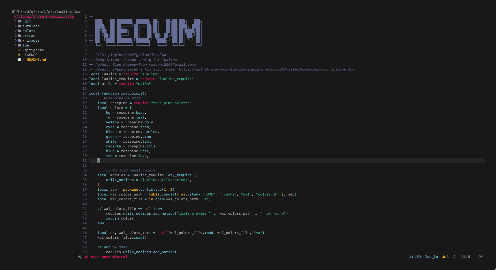
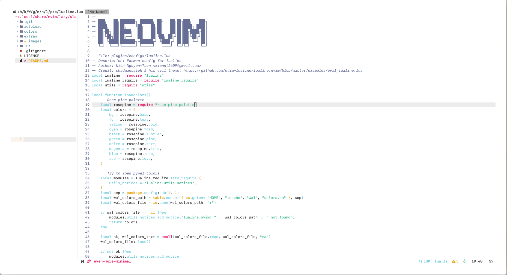

<div align="center">


<h1>slack.nvim</h1>

A Neovim colorscheme ported from [Slack](https://slack.com) colorscheme

<p align="center">
	<a href="https://github.com/ntk148v/slack.nvim/stargazers"></a>
	<a href="https://github.com/ntk148v/slack.nvim/issues"></a>
	<a href="https://github.com/ntk148v/slack.nvim/contributors"></a>
</p>

</div>

| Dark                                                                         | Light                                                                         |
| ---------------------------------------------------------------------------- | ----------------------------------------------------------------------------- |
|  |  |

Table of content:
- [1. ✨ Features](#1--features)
- [2. 📦 Installation](#2--installation)
- [3. 🚀 Usage](#3--usage)
- [4. 🔥 Contributing](#4--contributing)
- [5. :sparkles: Extras](#5-sparkles-extras)
- [6. :newspaper: License](#6-newspaper-license)


## 1. ✨ Features

- Supports the latest [Neovim](https://github.com/neovim/neovim)
  [0.9.0](https://github.com/neovim/neovim/releases/tag/v0.9.0) features.
- Terminal colors.
- Supports [treesitter](https://github.com/nvim-treesitter/nvim-treesitter) and related plugins.

## 2. 📦 Installation

- Using `vim-plug`:

```vim
Plug 'ntk148v/slack.nvim'
```

- Using `packer`:

```lua
use { "ntk148v/slack.nvim" }
```

- Using `lazy.nvim`:

```lua
{ "ntk148v/slack.nvim" }
```

## 3. 🚀 Usage

```vim
colorscheme slack
```

```lua
vim.cmd("colorscheme slack")
```

You can switch between light and dark variants by setting background.

## 4. 🔥 Contributing

This colorscheme is always in development and testing. Users are welcome to use it however for programming daily. In case a user spots any bugs or error especially related to the supported plugins, treesitter or built-in LSP highlight support, then they can contribute by opening an issue or by making a pull request. More plugin highlight support is also welcome.

## 5. :sparkles: Extras

- [base16](./extras/base16/)
- TODO: support multiple terminals.

## 6. :newspaper: License

[Apache 2.0](LICENSE)

---

<div align="center">
    <sub>Made with ❤️ by <a href="https://github.com/ntk148v">@ntk148v</a></sub>
</div>
